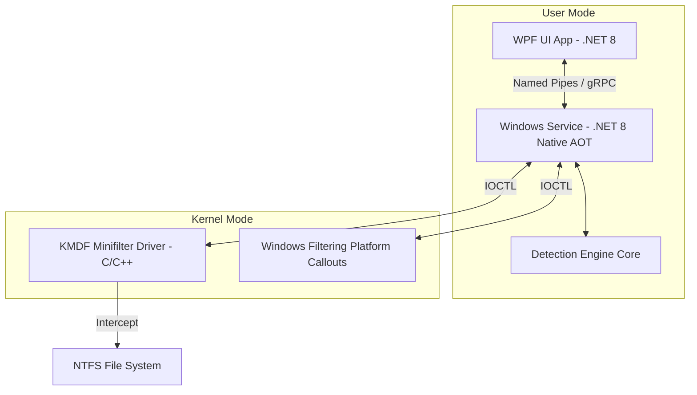
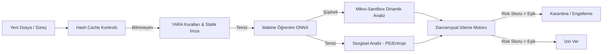
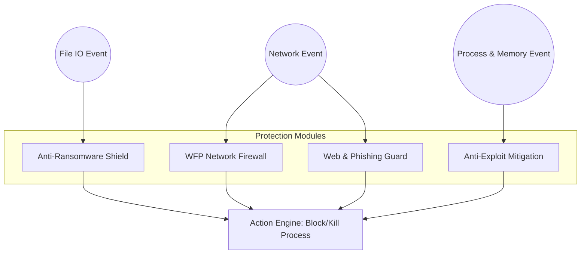
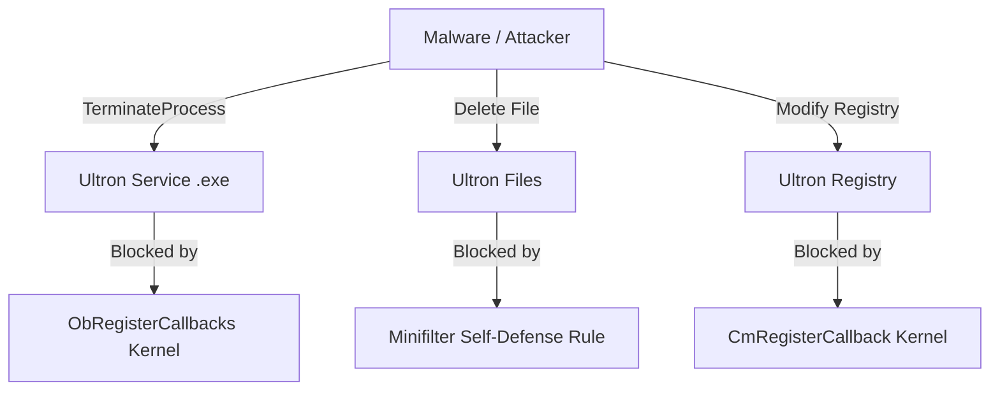
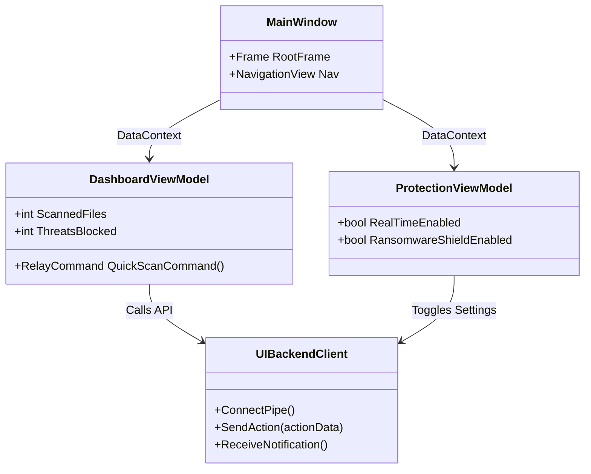
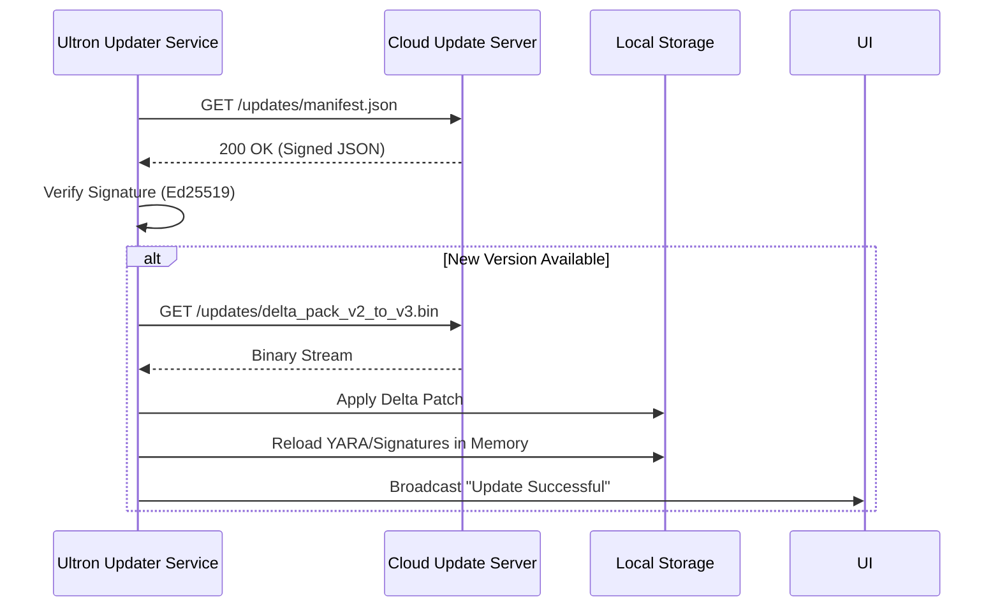
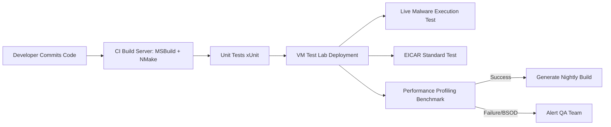

# Ultron Defender Total Security - NGAV Mimari Kılavuzu

Bu belge, Ultron Defender Total Security projesinin Yeni Nesil Antivirüs (Next-Generation Antivirus - NGAV) mimarisini, mevcut durumunu ve uzun vadeli mühendislik yol haritasını detaylandıran ana referans dokümanıdır.

---

## 1. ÇEKİRDEK MİMARİ VE PERFORMANS

**Öncelik Seviyesi:** KRİTİK  
**Tahmini Karmaşıklık:** Çok Yüksek  

### 1.1. Genel Bakış ve Temel Bileşenler

Sistemin temel taşı, işletim sistemiyle (Windows) olabildiğince alt seviyede entegre çalışacak, minimum kaynak tüketecek ve sistem kararlılığını bozmadan çalışacak çekirdek bileşenlerdir.

- **Kernel-level driver mimarisi (Windows Minifilter Driver):** Geleneksel antivirüs yazılımları dosya okuma ve yazma işlemlerini user-mode API hook'ları ile yapmaktaydı, fakat NGAV yaklaşımında WDF (Windows Driver Framework) altında KMDF (Kernel-Mode Driver Framework) Minifilter driver'lar zorunludur. Dosya sistemi yığınındaki IRP (I/O Request Packet) isteklerini presize şekilde filtreleyip engelleyebilmek (IRP_MJ_CREATE, IRP_MJ_WRITE) ana hedeftir.
- **User-mode servis ve UI arası iletişim (Named Pipes, IOCTL):** Güvenlik servisi (LocalSystem haklarıyla çalışan arka plan servisi) ile kullanıcı arayüzü (Standard User yetkisiyle çalışan UI) arası güvenli iletişim için Named Pipes kullanılacaktır. Driver ile Windows Service arasında ise DeviceIoControl (IOCTL) üzerinden yüksek hızlı haberleşme sağlanacaktır.
- **Bellek yönetimi ve düşük kaynak tüketimi stratejileri:** .NET tarafında Garbage Collector baskısını azaltmak için `Span<T>`, `Memory<T>` ve `ArrayPool<T>` kullanılacaktır. Büyük dosyaların taranması sırasında bellek şişmesini engellemek adına buffer tabanlı stream okumaları yapılacaktır.
- **Asenkron I/O ve iş parçacığı havuzu optimizasyonu:** Disk ve ağa erişen tüm I/O operasyonları Task-based Asynchronous Pattern (TAP) kullanılarak non-blocking şekilde yapılandırılacaktır. `IAsyncDisposable` ve `IAsyncEnumerable` arayüzlerinden aktif olarak yararlanılacaktır.
- **.NET 8 AOT derleme ve Native Image Generator (NGen):** UI ve motor performansını maksimize etmek, başlama süresini (startup time) milisaniyelere düşürmek ve tersine mühendisliği (reverse engineering) zorlaştırmak amacıyla Native AOT (Ahead-of-Time) derlemesi entegre edilecektir.

### 1.2. Mevcut Durum ve Hedefler

- **Mevcut Durum:** .NET 8 tabanlı WPF arayüz (Wpf.Ui) iskeleti, MVVM mimarisi (CommunityToolkit.Mvvm) ve temel IoC (Inversion of Control) yapısı mevcuttur. Asenkron I/O temel düzeyde uygulanmaktadır.
- **Yapılacaklar:**
  - C/C++ ile KMDF Minifilter Driver modülünün geliştirilmesi ve WHQL sertifikasyon testlerine hazırlanması.
  - Arka plan koruma servisinin (Windows Service) oluşturulması.
  - Driver ile Service arasında IOCTL iletişim köprüsünün C# p/invoke (DllImport/LibraryImport) ile bağlanması.

### 1.3. Mimari Diyagram

---

## 2. TESPİT MOTORLARI (DETECTION ENGINES)

**Öncelik Seviyesi:** KRİTİK  
**Tahmini Karmaşıklık:** Çok Yüksek  

### 2.1. Genel Bakış ve Analiz Yöntemleri

Bir NGAV'ın en önemli ayırıcı özelliği statik imzalara olan bağımlılığı azaltıp, sezgisel ve makine öğrenimi odaklı dinamik tespit yetenekleridir.

- **İmza Tabanlı Tespit:** YARA kural motoru entegre edilecek, saniyede on binlerce dosya hızlıca taranabilecektir. Ayrıca bilinen zararlılar için SHA256/SHA1/MD5 hash karşılaştırmaları in-memory SQLite veri tabanı üzerinden veya Bloom Filter kullanılarak ultra-hızlı yapılacaktır.
- **Sezgisel Analiz (Heuristics):** Portable Executable (PE) başlıklarında yer alan anomali tespiti (Örn: Section isimlerinin anormalliği, Entry Point gariplikleri). Entropi analizi yapılarak dosyanın şifrelenmiş veya paketlenmiş olup olmadığı tespit edilecektir (UPX, Themida, VMProtect).
- **Makine Öğrenimi:** Statik özellik çıkarma (PE imports, exports, API çağrıları, string analizi) sonrası veriler bir ONNX Runtime modeline verilecek ve LightGBM/XGBoost temelli karar ağaçları (veya derin öğrenme modelleri) ile zararlı skorlaması (malware scoring) yapılacaktır.
- **Davranış Analizi:** Şüpheli dosyalar izole edilmiş mikro-sandbox ortamında koşturulacak, oluşturdukları API çağrıları izlenecektir (API hooking). Süreç (process) ağaçları izlenecek, PowerShell veya CMD'yi parametrelerle başlatan Office belgeleri gibi şüpheli child process aktiviteleri tespit edilecektir.
- **Bellek Tarama:** Diskte dosya oluşturmadan doğrudan belleğe yüklenen zararlılar (fileless malware) için bellek taraması (Process hollowing, DLL injection, reflective DLL loading tespiti) uygulanacaktır.

### 2.2. Mevcut Durum ve Hedefler

- **Mevcut Durum:** Arayüz üzerinde "Hızlı Tarama", "Tam Tarama" gibi mock tetikleyiciler tasarlanmıştır. Ancak arkada çalışan gerçek bir motor henüz entegre edilmemiştir.
- **Yapılacaklar:**
  - C# için YARA wrapper kütüphanesinin (libyara) entegrasyonu.
  - Rust veya C++ ile PE analizi yapan bir unmanaged DLL yazılıp C#'tan çağrılması.
  - ONNX Runtime entegrasyonu ile eğitilmiş ilk statik zararlı tespit modelinin projeye eklenmesi.
  - Minifilter driver üzerinden "Process Creation" bildirimlerinin alınarak süreç ağacı motorunun (Process Tree Tracker) yazılması.

### 2.3. Mimari Diyagram

---

## 3. KORUMA KATMANLARI (REAL-TIME PROTECTION)

**Öncelik Seviyesi:** YÜKSEK  
**Tahmini Karmaşıklık:** Yüksek  

### 3.1. Genel Bakış ve Koruma Vektörleri

Sistemi enfeksiyondan önce (pre-execution) ve çalışma sırasında (post-execution) korumak için çok katmanlı bir savunma mekanizması kurulacaktır.

- **Dosya Sistemi Filtresi:** Minifilter driver üzerinden IRP_MJ_CREATE, IRP_MJ_WRITE ve IRP_MJ_SET_INFORMATION interception'ları yapılarak dosya sisteme yazılmadan önce in-memory scan (bellek içi tarama) gerçekleştirilecektir.
- **Ağ Koruması:** WFP (Windows Filtering Platform) entegrasyonu ile giden ve gelen ağ trafiği paket bazında incelenecektir. C2 (Command & Control) sunucularına bağlantı engellenecek, DNS üzerinden yapılan veri hırsızlığı (DNS exfiltration) ve kötü amaçlı domain çözümlemeleri bloke edilecektir.
- **Web Koruması:** Web tarayıcıları ve sistem uygulamaları tarafından yapılan HTTP/HTTPS isteklerinin sertifika bazlı ve URL reputation (URL itibar) veritabanı eşleştirmesi. Phishing (oltalama) sitelerinin engellenmesi.
- **E-posta Koruması:** Outlook, Thunderbird gibi istemciler için yerel SMTP/POP3/IMAP proxy'si oluşturularak gelen e-postalardaki ekler ve linkler statik olarak taranacaktır.
- **Fidye Yazılımı Kalkanı (Ransomware Shield):** Sistemin kritik dizinlerine gizli "Canary (Kanarya)" dosyalar yerleştirilecektir. Bu dosyaların aniden değiştirilmesi/şifrelenmesi fidye yazılımı belirtisi sayılacak ve işlemi yapan süreç anında sonlandırılacaktır. Ayrıca disk okuma/yazma paterni ve ani entropi yükselişi takip edilecektir. MBR ve VBR modifikasyonlarına karşı koruma sağlanacaktır.
- **Exploit Koruması:** İşletim sisteminin ASLR (Address Space Layout Randomization) ve DEP (Data Execution Prevention) önlemleri zorunlu kılınacaktır. ROP (Return-Oriented Programming) zinciri tespit algoritmaları enjekte edilecektir.

### 3.2. Mevcut Durum ve Hedefler

- **Mevcut Durum:** Kullanıcı arayüzünde "Gerçek Zamanlı Koruma", "Fidye Yazılımı Koruması", "Web Koruması" gibi modül aç/kapat (toggle) anahtarları tasarımsal olarak yerleştirilmiştir (Örn: Dashboard page).
- **Yapılacaklar:**
  - WFP Callout driver modülünün geliştirilip ağ paketlerinin filtreleme altyapısına bağlanması.
  - Anti-Ransomware motoru için Canary file oluşturucu ve monitör servisinin C# tarafında yazılması (FileSystemWatcher ve Minifilter kombinasyonu ile).
  - URL reputation kontrolü için bulut API entegrasyonu.

### 3.3. Mimari Diyagram

---

## 4. GÜVENLİK VE SAĞLAMLAŞTIRMA (SELF-DEFENSE)

**Öncelik Seviyesi:** KRİTİK  
**Tahmini Karmaşıklık:** Orta  

### 4.1. Genel Bakış ve Mekanizmalar

Güvenlik yazılımının kendisi, zararlılar için ilk hedeftir. Kendi dosyalarını, registry anahtarlarını, servislerini ve süreçlerini korumak (Self-Defense) antivirüsün ayakta kalması için şarttır.

- **Kendi süreçlerini ve dosyalarını koruma:** Antivirüse ait klasörler (`C:\Program Files\Ultron Defender`), kayıt defteri girdileri ve çalışan `.exe`/`.sys` süreçleri, kernel driver seviyesinde `ObRegisterCallbacks` kullanılarak silinmeye, değiştirilmeye ve dışarıdan müdahaleye kapatılacaktır.
- **Kod imzalama ve bütünlük doğrulama:** Uygulamanın tüm DLL ve EXE dosyaları Authenticode ile imzalanacaktır. Çalışma anında (runtime) belleğe yüklenen modüllerin imza geçerliliği kontrol edilecektir.
- **Anti-tampering (Kurcalama Koruması):** Hata ayıklayıcı (debugger) tespiti (`IsDebuggerPresent`, `CheckRemoteDebuggerPresent`, PEB kontrolleri) yapılacak ve uygulama analiz edilmeye çalışıldığında kendisini sonlandıracaktır. Ayrıca user-mode API hook tespiti yapılarak bellekteki DLL'lerin orijinal diskin üzerindeki DLL'ler ile bayt düzeyinde bütünlüğü kıyaslanacaktır.
- **Güvenli güncelleme mekanizması:** Güncellemeler TLS 1.3 üzerinden çekilecek, paketler Ed25519 veya RSA-4096 ile imzalanmış manifestolar üzerinden doğrulanacaktır. MitM (Man-in-the-Middle) saldırılarına karşı korunacaktır.
- **Hassas veri şifreleme:** Lisans anahtarları, bulut API token'ları ve loglar Windows DPAPI (Data Protection API) kullanılarak yalnızca yerel makinede okunabilecek şekilde kriptolanacaktır.

### 4.2. Mevcut Durum ve Hedefler

- **Mevcut Durum:** .NET seviyesinde kod güvenliği (obfuscation vs.) henüz eklenmemiştir. Arayüz herhangi bir standart dosya gibi çalışmaktadır.
- **Yapılacaklar:**
  - CI/CD pipelinelarında kod imzalama (Code Signing Certificate) entegrasyonu.
  - Driver içerisine ObRegisterCallbacks implementasyonunun eklenerek kendi process ID'sini koruma altına alması.
  - .NET obfuscator (ör. Dotfuscator) entegrasyonu ve AOT ile decompile edilmenin zorlaştırılması.

### 4.3. Mimari Diyagram

---

## 5. KULLANICI ARAYÜZÜ VE YÖNETİM

**Öncelik Seviyesi:** ORTA  
**Tahmini Karmaşıklık:** Orta  

### 5.1. Genel Bakış ve UX Stratejisi

Son kullanıcılar için kolay anlaşılır, modern, karanlık/aydınlık (Dark/Light) tema destekli ve performansı yüksek bir deneyim hedeflenmektedir.

- **Modern WPF/Fluent UI mimarisi:** Uygulamanın UI/UX tasarımı "Wpf.Ui" kütüphanesi üzerine inşa edilmiş, Windows 11 Fluent Design dillerine (Mica material, yuvarlak köşeler, modern animasyonlar) uyumlu hale getirilmiştir. Bitdefender tarzı kırmıı-beyaz-siyah kontrastı ve Metric/Feature kartları uygulanmaktadır.
- **Bildirim sistemi:** Tehdit tespit edildiğinde, güncelleme tamamlandığında veya arka plan taraması bittiğinde Toast Notifications ve System Tray (Notification Area) Balloon bildirimleri tetiklenecektir.
- **Raporlama ve istatistikler:** Tarama geçmişi, engellenen tehditler, karantinadaki ögeler in-memory (veya SQLite) veritabanında saklanıp arayüzde interaktif grafikler (LiveCharts2 vb.) ile sunulacaktır.
- **Merkezi yönetim konsolu:** Kurumsal sürüm (Enterprise Edition) için birden çok istemcinin (endpoint) durumunu gösteren bir web tabanlı bulut yönetim konsoluyla haberleşecek API client altyapısı kurulacaktır.
- **Otomatik karantina yönetimi:** Zararlı bulunan dosyalar şifrelenerek (`.ultron` uzantılı) özel bir dizine taşınacak, kullanıcı arayüzünden bu dosyalar "Geri Yükle", "Sil", "İstisna Ekle" opsiyonlarıyla yönetilebilecektir.

### 5.2. Mevcut Durum ve Hedefler

- **Mevcut Durum:** WPF projesi kurulmuş, `SharedStyles.xaml` ve kaynak dosyaları oluşturulmuştur. Ana sayfa (Dashboard), Koruma modülleri ve Ayarlar sayfaları MVVM yapısında mock verilerle tasarlanmıştır. Çeviriler (Türkçe) yapılandırılmıştır.
- **Yapılacaklar:**
  - SQLite (Entity Framework Core veya Dapper) entegrasyonu ile geçmiş verilerin saklanması.
  - Hardcoded verilerin, Windows Service'ten gelen gerçek zamanlı canlı verilerle değiştirilmesi.
  - Görev çubuğu (Tray Icon) sağ tık menüsünün işlevsel hale getirilmesi (Hardened UI).

### 5.3. Mimari Diyagram

---

## 6. GÜNCELLEME VE BAKIM

**Öncelik Seviyesi:** YÜKSEK  
**Tahmini Karmaşıklık:** Orta  

### 6.1. Genel Bakış ve Süreklilik

Sürekli evrilen tehditlere karşı antivirüsün günde birkaç kez sessizce güncellenmesi gerekir.

- **İmza veritabanı güncelleme mekanizması:** YARA kuralları, kötü amaçlı IP ve URL listeleri bulut sunucularından periyodik olarak (örneğin her 4 saatte bir) çekilecektir.
- **Delta güncellemeler ve bandwidth optimizasyonu:** Sadece değişen veya eklenen imzalar indirilecek, böylece ağ band genişliği tüketilmeyecektir. İkili (Binary) delta yamalama (bsdiff benzeri) teknikleri kullanılacaktır.
- **Otomatik program güncellemesi:** Programın kendi çalıştırılabilir dosyaları (.exe, .sys) arka planda indirilip, reboot gerektirmeyen (veya sadece driver için minimum reboot gerektiren) şekilde sessiz güncellenecektir.
- **Telemetri ve tehdit istihbaratı toplama:** Bilinmeyen veya şüpheli yürütülebilir dosyaların hash'leri, istatistikleri ve tespit logları anonimleştirilerek buluta gönderilecek (opt-in mantığı), böylece makine öğrenimi modellerinin sürekli eğitilmesi sağlanacaktır.
- **Sertifika sabitleme (certificate pinning):** Güncelleme sunucusuna yapılan tüm bağlantılarda sunucu sertifikasının public key hash'i kontrol edilecek, DNS zehirlenmesi veya HTTPS interception durumlarında güncellemeler durdurularak güvenlik sağlanacaktır.

### 6.2. Mevcut Durum ve Hedefler

- **Mevcut Durum:** Ayarlar sayfasında mock bir güncelleme butonu ve versiyon bilgisi bulunmaktadır.
- **Yapılacaklar:**
  - AWS S3 / Cloudflare CDN üzerinde statik güncelleme paketleri sunucusunun ayağa kaldırılması.
  - C# Updater servisinin (Arka planda çalışan bağımsız bir executable veya servis içi thread) yazılması.
  - Delta patch (Rsync/Bsdiff mantığı) modülünün entegre edilmesi.

### 6.3. Mimari Diyagram

---

## 7. TEST VE DOĞRULAMA SENARYOLARI

**Öncelik Seviyesi:** YÜKSEK  
**Tahmini Karmaşıklık:** Orta  

### 7.1. Genel Bakış ve Kalite Güvencesi (QA)

Ürünün güvenlik standartlarını karşıladığından ve sistemleri çökertmediğinden (BSOD - Blue Screen of Death) emin olmak için rigoröz test aşamalarından geçmesi gerekmektedir.

- **EICAR test dosyası doğrulaması:** Endüstri standardı EICAR.COM ve şifreli zip formatındaki EICAR dosyaları motor tarafından %100 tespit edilmeli ve saniyeler içinde karantinaya alınmalıdır.
- **AMTSO (Anti-Malware Testing Standards Organization) testleri:** Phishing sayfası testi, potansiyel olarak istenmeyen uygulama (PUA) indirme testi, bulut tabanlı koruma testi gibi tüm AMTSO standart testlerinin otomatize geçilmesi.
- **Performans benchmark'ları:** Boşta CPU kullanımının %1'in, RAM kullanımının 100MB'ın altında kalması. Ağır dosya I/O operasyonlarında (Örn: Visual Studio derlemesi, büyük oyun kurulumları) sistem gecikmesinin %5'in üstüne çıkmaması hedeflenmektedir.
- **False positive / negative oranı ölçümü:** Sıklıkla kullanılan zararsız Windows süreçlerinin (svchost, explorer) veya popüler üçüncü parti yazılımların yanlışlıkla engellenmesini (False Positive) önlemek adına devasa bir "Whitelisting" hash veritabanı ile test edilmesi.
- **Stress testleri ve bellek sızıntısı kontrolleri:** Günlerce süren aralıksız tarama simülasyonları ile C# ve C++ tarafında memory leak (bellek sızıntısı) analizi (dotMemory ve Valgrind/UMDH araçlarıyla). KMDF driver için Driver Verifier aktif edilerek stress testlerinin yapılması.

### 7.2. Mevcut Durum ve Hedefler

- **Mevcut Durum:** xUnit projesi altyapısı proje bazında eklenebilir, henüz aktif test senaryoları kodlanmamıştır.
- **Yapılacaklar:**
  - CI/CD (GitHub Actions veya Azure DevOps) üzerinde test otomasyon boru hatlarının kurulması.
  - Driver testleri için Windows Hardware Lab Kit (HLK) ortamının bir VM farm üzerinde kurulması.
  - Günlük (Nightly) otomatik performans metrik raporlamasının Slack/Teams üzerinden duyurulması.

### 7.3. Mimari Diyagram

---
*Belge Sonu - Bu belge mimari tasarım geliştikçe güncellenmelidir.*
