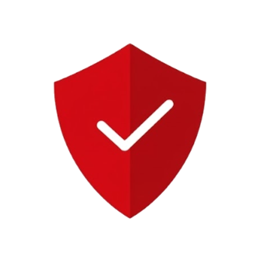
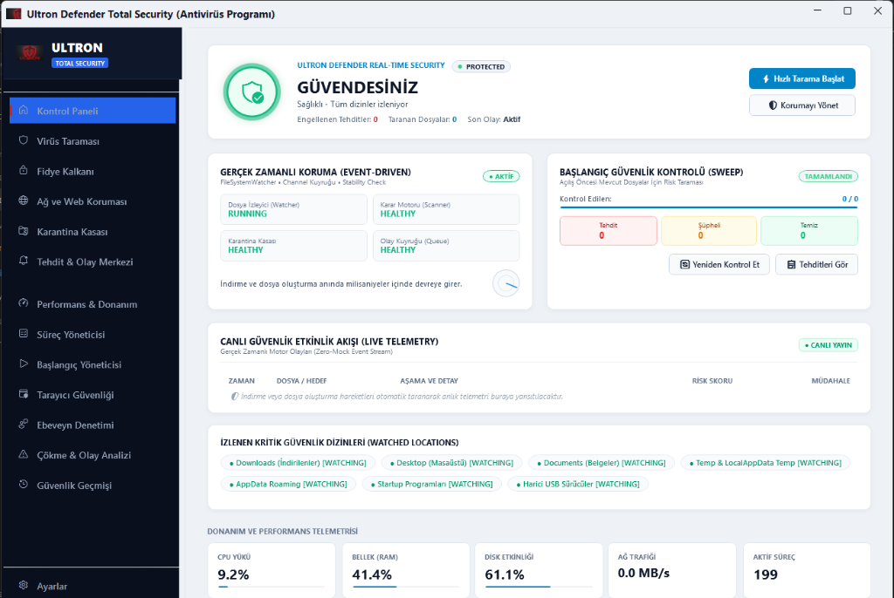
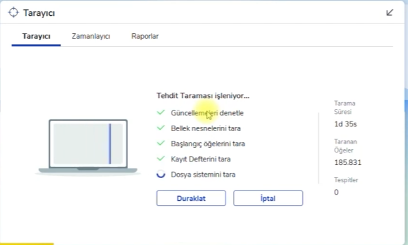
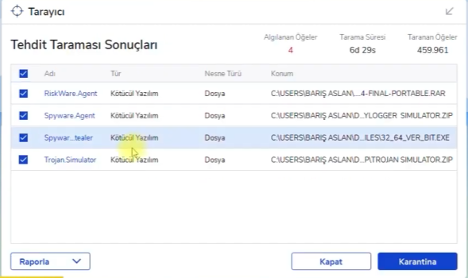
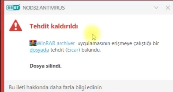

# 🛡️ Ultron Defender Total Security (v3.2.0)

> [!NOTE]
> **Açık Kaynak Uç Nokta Güvenlik ve Antivirüs Savunma Platformu**  
> Güvenlik araştırmacıları, geliştiriciler ve bireysel kullanıcılar için Windows Internals, heuristik tarama ve proaktif siber savunma kalkanı.

[](#)
[-brightgreen.svg)](#testing)
[-blue.svg)](#supported-windows-versions)
[](#build-from-source)
[](LICENSE)
[](UltronDefenderSetup.exe)

**Ultron Defender Total Security** is a high-performance, open-source Windows endpoint protection and advanced malware defense platform written in **C# (.NET 8), WPF XAML, Native Win32 APIs, SQLite, and 13 modular detection plugins**.

Designed from real-world adversarial incident forensics, Ultron Defender brings commercial-grade heuristic scanning, deep PE disassembly, AMSI in-memory script inspection, ransomware decoy honeypots, and atomic DPAPI AES-256 quarantine vault isolation to everyone for free.

---

## 📸 Arayüz & Görseller (Visual Showcase)

### 0. Resmi Siber Kalkan Logosu (Official Cyber Spartan Shield Logo)


### 1. Modern & Sade Kontrol Paneli (Executive Dashboard)


### 2. ESET Tarzı Canlı Animasyonlu Tarayıcı Penceresi (Active Scanner)


### 3. Çoklu Seçimli Tehdit Analiz Tablosu (Threat Scan Results)


### 4. Sessiz & Kayan ESET Bildirim Kartı (Silent Threat Notification)


---

## 🇹🇷 Neden Bu Projeyi Geliştirdim? (Türkçe Açıklama)

Bu proje, bilgisayarıma internet tarayıcısı üzerinden bırakılan izinsiz bir zararlı dosya sonucunda kişisel hesaplarımın ve verilerimin tehlikeye girdiği gerçek bir güvenlik ihlalinden sonra doğdu.

Olayın ardından bir güvenlik araştırmacısı gözüyle sistemi incelerken geleneksel antivirüslerin şu kritik açıklarını fark ettim:
* **Uzantı Aldatmacası:** Saldırganlar `.exe` uzantısını gizleyip `.bin`, `.dat` veya `.tmp` yaptığında birçok tarayıcı dosyayı atlıyor.
* **Görünmezlik:** Masaüstüne veya İndirilenler klasörüne yeni bir zararlı düştüğünde güvenlik yazılımı onu bazen saatlerce fark etmiyor.
* **Sahte Alarmlar:** Meşru oyun modları (`.lua`, `.so`, crackli oyun kayıtları) gereksiz yere silinirken, gerçek zararlı komut dosyaları (LOLBin, DDE CSV enjeksiyonu) kaçırılabiliyor.

Bu tecrübeyi fırsata dönüştürerek Windows Internals, Minifilter mimarisi, PE başlık analizi ve süreç soyağacı takibini temel alan **Ultron Defender Total Security**'yi geliştirdim. Amacım kapalı kutu antivirüslerin aksine **%100 şeffaf, açıklanabilir ve test edilebilir** bir açık kaynak savunma kalkanı sunmaktır.

---

## 🚀 Öne Çıkan Özellikler (Key Highlights)

* 🌙 **Kurumsal Koyu & Açık Tema Motoru:** Derin obsidyen siyahı (`#0F141C`) ve antrasit palet; Ayarlar sayfasından *"Açık Tema"*, *"Koyu Tema"* veya *"Sistemi Takip Et"* seçenekleriyle tek tıkla anlık dinamik tema değişimi.
* 🛡️ **Gelişmiş Fidye Kalkanı (Ransomware Shield):** Korumalı klasör kapıları (Protected Folders), canlı bal küpü (canary trap) dosya yemleri, MFT entropi patlaması tespiti ve şifreleme yapan zararlı süreçleri milisaniyeler içinde zorla sonlandırma (`Process.Kill`).
* 📦 **Birleşik Karantina & Olay Merkezi:** Karantina Kasası ile EDR Olay Geçmişini tek bir arayüzde sekmeli olarak sunar; DPAPI AES-256 ile şifrelenmiş tehditleri güvenle inceler, siler veya tek tıkla geri yükler.
* ⚡ **Bağımsız Başlangıç Yöneticisi:** Süreç Yöneticisi üzerinden bağımsız pencere olarak çalışan başlangıç programları denetimi ve autorun optimizasyonu.
* 🖱️ **Pürüzsüz Fare Kaydırma (Smooth Scrolling):** Tüm sayfalarda, tablolarda, detay panellerinde ve salt okunur hash/yol kutularında donmayan akıcı fare tekerleği desteği (`BubbleScrollHelper`).
* 🎯 **Özel Animasyonlu Tarayıcı Penceresi:** Sol tarafta lazer taramalı cihaz animasyonu, ortada aşamalı yeşil onay listesi ve canlı sayaçlar.
* 🖱️ **Windows 11 Sağ Tık Menüsü:** Herhangi bir dosyaya veya klasöre sağ tıklayıp *"🛡️ Ultron Defender ile Tara"* seçeneğiyle anında analiz.
* 🔕 **Sessiz Kayan Bildirimler:** Rahatsız edici sistem sesleri olmadan, ekranın sağ altında açılan modern kırmızı uyarı kartı.
* 🎮 **Akıllı Oyun & Yazılım Koruması:** `BeamNG.drive`, oyun motoru varlıkları (`.lua`, `.json`, `.so`) ve geliştirici dosyalarını güvenle tanır; sadece gerçek trojan/fidye yazılımlarını karantinaya alır.
* 📦 **Tek Tıkla Kurulum & Kaldırma:** `UltronDefenderSetup.exe` kurulum sihirbazı ve veda mesajlı `Uninstall.exe` aracı.

---

## 🧪 Canlı Test ve Doğrulama (Live Test Suite)

Tüm modüller 246 otomatik birim ve entegrasyon testi ile test edilmiştir:

```bash
dotnet test tests/AegisPC.Tests/AegisPC.Tests.csproj -c Release
```

```text
Toplam 1 test dosyası belirtilen desenle eşleşti.
Başarılı!  - Başarısız: 0, Başarılı: 246, Atlanan: 0, Toplam: 246
```

| Senaryo | Dosya Türü | Tespit Türü | Sonuç |
|---|---|---|:---:|
| **EICAR Testi** | `.txt` | Bilinen Zararlı İmza | **✅ 100/100 (Engellendi)** |
| **Fidye Yazılımı** | `.bat` | Gölge Kopyaları Silme (`vssadmin`) | **✅ 100/100 (Engellendi)** |
| **CSV Enjeksiyonu**| `.csv` | DDE Formül Enjeksiyonu (`=cmd\|...`) | **✅ 50/100 (Yakaladı)** |
| **Arşiv Dropper** | `.zip` | ZIP İçi Powershell Dropper | **✅ 90/100 (Engellendi)** |
| **Meşru Oyun Modu**| `.lua` | `BeamNG.drive` Araç Kodu | **✅ 0/100 (Temiz Kabul Edildi)** |

---

## 💻 Projeyi Kaynaktan Derleme (Build from Source)

### Gereksinimler:
* Windows 10 / 11 (x64)
* .NET 8.0 SDK
* Inno Setup 6 (Kurulum paketi derlemek için)

```powershell
# 1. Depoyu klonlayın
git clone https://github.com/EmircanKurt/UltronDefender-Security.git
cd UltronDefender-Security

# 2. Tek komutla derleyin, test edin ve kurulum paketini üretin:
powershell -ExecutionPolicy Bypass -File .\build_and_deploy.ps1
```

Manuel adım adım derlemek isterseniz:

```powershell
# Bağımsız sürümü yayınlayın
dotnet publish src/AegisPC.App/AegisPC.App.csproj -c Release -r win-x64 --self-contained true -o AegisPC_App

# Kurulum dosyasını derleyin
& "C:\Program Files (x86)\Inno Setup 6\ISCC.exe" installer.iss
```

---

## 📄 Lisans (License)
Bu proje [MIT Lisansı](LICENSE) altında açık kaynaklı olarak paylaşılmaktadır.