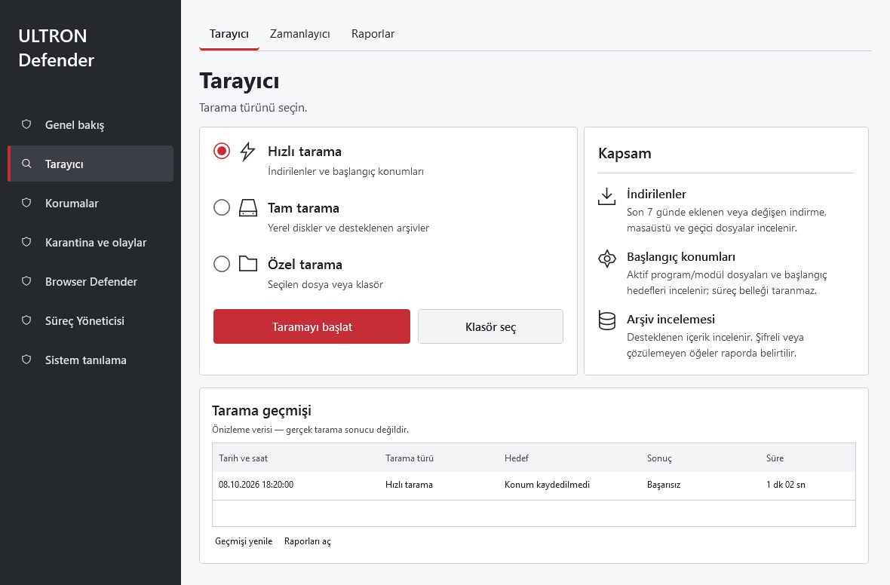
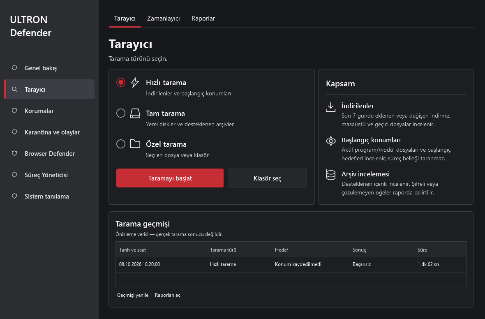
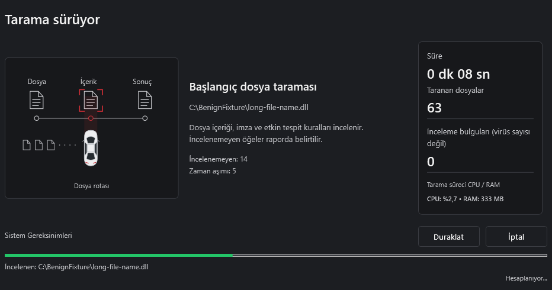
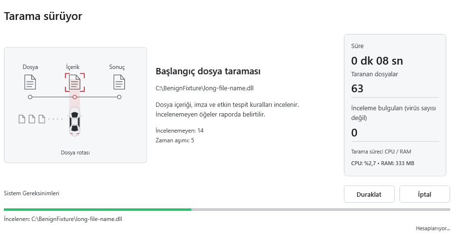

<p align="center"></p>

# Ultron Defender

A free, open-source Windows security project focused on understandable file analysis, local monitoring and honest protection status.

**Experimental preview — use alongside Microsoft Defender, not instead of it.** Independent antivirus efficacy testing and isolated Windows VM deployment testing have not yet been completed. VM testing is planned next; no completion date is promised.

## Why I started

I started this project after losing access to gaming and email accounts in an incident I believe was connected to a malicious game mod. I had disabled Windows protection after dismissing earlier warnings. That experience encouraged me to learn more about software development and defensive security, and to build something useful from it.

This is my personal account, not a verified forensic investigation or proof that Ultron would have prevented the incident. My goal is to make security decisions easier to understand, without suggesting that any tool guarantees safety.

— Emircan Kurt · [Writing on Medium](https://medium.com/@kurtemircan118)

## What the current code does

- Quick, full and selected-path scans with findings, counters and reports.
- File structure classification rather than trusting extensions, with bounded archive inspection.
- User-mode monitoring of configured folders and post-start process observations. Background protection depends on a running, compatible Windows service.
- Local Ultron AI review: handwritten rules and mathematical scoring, **not a chatbot, downloaded LLM or calibrated malware probability**.
- USB/storage/HID discovery and notices. A reported keyboard identity is not proof of safe firmware.
- Quarantine infrastructure with ownership and integrity checks. Some UI operations remain deliberately blocked while their authorization path is unfinished.

These are implemented components, not claims of complete coverage. Independent Guardian protection and emergency native actions remain development work. Ultron does not promise pre-access blocking, firmware verification or superiority to Defender, Bitdefender or Kaspersky.

## Free means free

The current edition has no paid activation key, subscription or expiry. The MIT source license is not an activation requirement. A Windows protection service is a technical background component, not a paid feature. Missing service information must not be presented as active protection.

## Testing and limits

### Final preview audit — 10 October 2026

Preview **3.2.4-preview.20261010** adds committed-cache barriers, ordered invalidation/clear, detached verdict snapshots, UTC-safe persistence, independent Quick/Full history and a cache-owner write-permission correction. **654 selected benign regressions passed, 0 failed/skipped**; this includes temporary database/archive fixtures, fake-HTTP signed-update integrity, synthetic policy and off-screen WPF tests, not a malware-detection rate. See [the final audit](docs/reports/FINAL_AUDIT_2026-10-10.md) and its unfinished VM/corpus/native gates. CI now also checks stacked review branches. No service, driver or Defender setting is changed by building this preview.

### Game/mod reliability and native menu follow-up

The [9 October game/mod report](docs/reports/GAME_MOD_SAFETY_2026-10-09.md) describes preview 3.2.3: actual native-menu theme regressions, deterministic ordinary-capability scoring, removal of legacy filename/unproven-hash decisions, optional tool-only presentation, versioned content-verified caches and shared ZIP/JAR rule mapping. The exact candidate passed **580 selected benign regressions, 0 failures/skips**; both solution and Review Release builds had **0 warnings/errors**. It adds no game-folder trust exemption. Real 30-file corpus, cold/warm comparison, full contained PE parity, live DPI and VirtualBox gates remain pending; optional third-party classification is inactive until a publisher key is provisioned. No production-protection or crack-safety guarantee is made. Review separately: [native menu PR10](https://github.com/EmircanKurt/UltronDefender-Security/pull/10), [stacked engine PR11](https://github.com/EmircanKurt/UltronDefender-Security/pull/11), both draft.

### Changes since the 6 October preview

- Plain scan chooser with a scope panel, embedded scan route, silent startup/AFK presentation and clearer partial-coverage reporting.
- Light-theme sidebar selection/hover contrast corrected; off-screen WPF layout/contrast regressions cover both palettes.
- Ordinary API/syscall references are capabilities, not proof of evasion. Unknown signature verification is not an invalid signature. Findings retain rule version and coverage, without invented process attribution or quarantine success.
- Quick scope uses active program/module files, autorun/startup targets and recent (seven-day) Downloads/Desktop/Temp content. Full scans run the quick preflight before fixed volumes; failed/cancelled discovery is not successful completion.
- Protected-folder application allowances now require the recorded SHA-256; replacement content and legacy path-only entries do not inherit permission.
- Guardian health expires stale/future core leases. Native recovery, independent vault ownership and kernel enforcement still await isolated VM verification.
- Preview setup has a separate per-user installation identity, bundles its runtime, and does not install/start services, drivers or autostart entries. It does not replace the existing installation or launch Ultron automatically.

The [earlier 9 October Guardian/scan stage](docs/reports/GUARD_SCAN_SAFETY_2026-10-09.md) passed **537 selected tests, 0 failed, 0 skipped**. Its historical total does not replace the newer 580-test game/mod candidate above. These are unit/infrastructure/UI and inert disk-fixture tests, not a malware-detection rate or a deployed-protection certification.

See the [current verification report](docs/STATUS.md) for actual results and outstanding gates. Regression totals do **not** measure malware detection or false-positive rates. EICAR is a workflow test, not real-world efficacy evidence.

The [6 October scan/resource review](docs/reports/RESOURCE_CORRECTNESS_2026-10-06.md) preserves earlier resource evidence. Current resource policies use adaptive upper budgets rather than filling RAM or burning CPU to hit a percentage. Disk latency, real throughput and competing load limit concurrency; unknown telemetry must not be presented as measured spare capacity. Small benign benchmarks are not whole-PC speed claims.

Windows 10/11 x64 are development targets; this .NET 8 build does not support Windows 7. Antivirus cannot repair operating-system vulnerabilities or replace supported Windows updates. Keep Defender and workplace protection enabled. School/work deployment requires administrator approval and an isolated pilot.

## Build and review

Requirements: Windows and .NET 8 SDK; Inno Setup 6 only for installer generation.

The latest candidate is on `codex/final-audit-2026-10-10`, stacked on the earlier game/mod, native-menu and guard/scan reviews. The default branch can still contain older application code until those reviews are merged. The commands below select this preview, not a recommended production release.

```powershell
git clone --branch codex/final-audit-2026-10-10 https://github.com/EmircanKurt/UltronDefender-Security.git
cd UltronDefender-Security
dotnet build tests/AegisPC.Review.Tests/AegisPC.Review.Tests.csproj -c Release -warnaserror
./scripts/Test-BenignPreview.ps1 -NoBuild
dotnet publish src/AegisPC.App/AegisPC.App.csproj -c Release -o artifacts/preview/app
```

These commands do not install/start a service. The main test project includes live OS/credential/process fixtures: do not run its whole suite on an everyday PC. Building an installer is not installing it or validating a release.

## Downloads and screenshots

### Downloads

- [Releases and preview downloads](https://github.com/EmircanKurt/UltronDefender-Security/releases) — select **3.2.4-preview.20261010** when it is available; do not substitute older August/October packages. Each preview asset has a matching SHA256SUMS file. No validated, signed production installer is available.
- [Current preview source — 10 October 2026](https://github.com/EmircanKurt/UltronDefender-Security/tree/codex/final-audit-2026-10-10) — includes the earlier interface, scan-safety and game/mod work. Setup is unsigned and intended for an isolated VM pilot, not a replacement for Defender.

Signing, installation/uninstallation, rollback and isolated Windows VM checks remain required before recommending a new setup. Keep Microsoft Defender enabled.

### Current interface previews

The images below were rendered from the actual WPF controls in the [9 October preview source](https://github.com/EmircanKurt/UltronDefender-Security/tree/118e7cd38760ced1060c9b95505e4c0d04fb12bc). They are **off-screen UI previews with synthetic test data**, not screenshots of a deployed protection service. The sidebar is a test shell using the real item style. History, file paths, scan counts, elapsed time and CPU/RAM readings are fixture values, not protection or performance evidence.

**Light theme — scan selection, scope and history**



**Dark theme — the same scan controls**



<details>
<summary>Scanning view — file route, controls and sample counters</summary>

The file-route animation is shown as a still frame. Both views use a harmless synthetic path; they do not show a real malware scan.

**Dark theme**



**Light theme**



</details>

[Preview gallery and provenance](docs/screenshots/README.md). Legacy images are no longer used here; they do not represent the current preview.

## Help improve Ultron

Useful contributions include reproducible scan failures, benign false-positive cases, readable UI improvements and measured performance reports. Do not attach credentials or live malware to public issues.

[Contributing](CONTRIBUTING.md) · [Security reporting](SECURITY.md) · [Community standards](CODE_OF_CONDUCT.md) · [MIT license](LICENSE) · [Third-party notices](docs/architecture/THIRD_PARTY_NOTICES.md)
